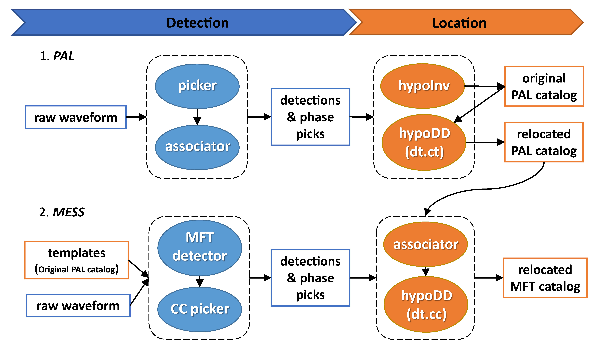

# PALM 4.x

An Earthquake Detection and Location Architecture for Continuous Seismograms: Phase Picking, Association, Location, and Matched Filter (PALM)  
  
## **PALM Workflow**  
  

### 1. PAL
1. phase **P**icking
2. phase **A**ssociation
3. event **L**ocation

- **Usage** (see *run_pal* for example workdir)
1. Prepare continuous data into consistent directory structure  
2. Run PAL  

### 2. MESS  
1. **M**atch: calculate CC trace on every station (matched filter)  
2. **E**xpand: expand peak values on CC traces  
3. **S**hift: time shift to origin times for all CC traces  
4. **S**tack: stack CC traces of different stations & detect events on the stacked trace  
5. *dt_p* and *dt_s* are picked by cross-correlation  

- **Usage** (see *run_mess* for example workdir)  
1. Prepare template phase file (i.e. run PAL) & cut template waveform  
2. Run MESS  

- **Tutorials**  
2021/10 Online training in Chinese: vedio recording on [KouShare](https://www.koushare.com/lives/room/549779)  
2022/08 Online training in Chinese: vedio recording on [KouShare](https://www.koushare.com/video/videodetail/31656)  

## Installation

PALM is a set of codes. All you need is to setup proper Python environment. This can be accomplished easily by installing [Anaconda](https://www.anaconda.com/products/individual#Downloads) and [Obspy](https://github.com/obspy/obspy/wiki/Installation-via-Anaconda) sequentially.  

## References

- Ding, H., **Y. Zhou**`*`, Z. Ge`*`, T. Taymaz, A. Ghosh, ... & X. Song`*` (2023). High-Resolution Seismicity Imaging and Early Aftershocks Migration of the 2023 Kahramanmaraş (SE Türkiye) Mw 7.9 & 7.8 Earthquake Doublet. *Earthquake Science*; doi: [10.1016/j.eqs.2023.06.002](https://doi.org/10.1016/j.eqs.2023.06.002)  

- **Zhou, Y.**`*`, C. Ren, A. Ghosh, H. Meng, L. Fang`*`, H. Yue, et al. (2022). Seismological Characterization of the 2021 Yangbi Foreshock-Mainshock Sequence, Yunnan, China: More than a Triggered Cascade. *Journal of Geophysical Research: Solid Earth*; 127(8). doi: [10.1029/2022JB024534](https://doi.org/10.1029/2022JB024534)  

- **Zhou, Y.**`*`, H. Yue`*`, S. Zhou, L. Fang, Y. Zhou, L. Xu, et al. (2022). Microseismicity along Xiaojiang Fault Zone (Southeastern Tibetan Plateau) and the Characterization of Interseismic Fault Behavior. *Tectonophysics*; 833: 229364. doi: [10.1016/j.tecto.2022.229364](https://doi.org/10.1016/j.tecto.2022.229364)  

- **Zhou, Y.**, A. Ghosh, L. Fang`*`, H. Yue`*`, S. Zhou, & Y. Su (2021). A High-Resolution Seismic Catalog for the 2021 MS6.4/Mw6.1 YangBi Earthquake Sequence, Yunnan, China: Application of AI picker and Matched Filter. *Earthquake Science*; 34(5): 390-398. doi: [10.29382/eqs-2021-0031](https://doi.org/10.29382/eqs-2021-0031)  

- **Zhou, Y.**, H. Yue, L. Fang, S. Zhou`*`, L. Zhao, & A. Ghosh (2021). An Earthquake Detection and Location Architecture for Continuous Seismograms: Phase Picking, Association, Location, and Matched Filter (PALM). *Seismological Research Letters*; 93(1): 413–425. doi: [10.1785/0220210111](https://doi.org/10.1785/0220210111)  
